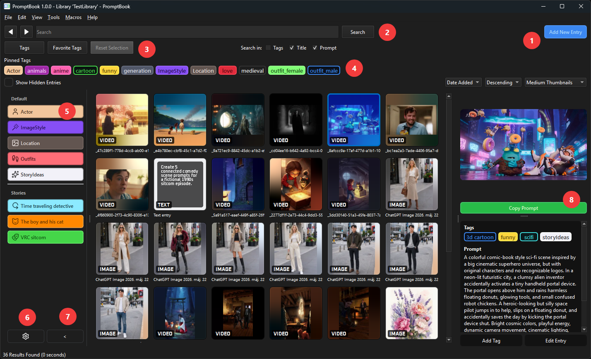
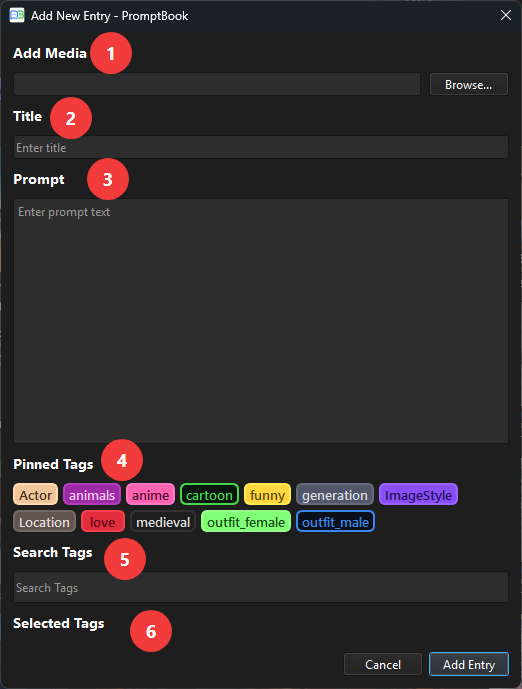
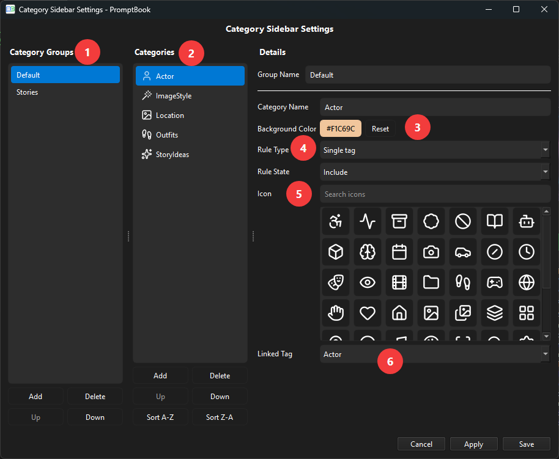

# PromptBook

PromptBook is a prompt-focused media library for managing prompts alongside the images and videos they produce.

It is a modified fork of [TagStudio](https://github.com/TagStudioDev/TagStudio), adapted for prompt-based workflows and AI-generated media organization.


## What is PromptBook?

PromptBook helps you organize prompts and the files connected to them in a local library.

It is designed for workflows where prompts, generated images, videos, notes, text outputs, and related assets belong together. The goal is to make previous prompts and results easier to search, review, compare, reuse, and archive.

PromptBook is especially useful if you work with AI-generated media and want a structured way to keep track of:

- prompts
- generated images
- generated videos
- text outputs
- project notes
- tags and categories
- related source files

## Feature Highlights

### Local Libraries

PromptBook uses local libraries to store metadata for your files.

Your files do not need to be moved into a special application folder. PromptBook stores library information separately and links entries to files on your system.

### Prompt-Focused Entries

Entries can represent prompts, generated images, videos, text outputs, or other related files.

This makes it possible to keep prompts and their results together in one searchable library.

### Tags and Categories

Use tags and categories to organize your library by:

- subject
- style
- model
- project
- character
- location
- output type
- workflow stage
- custom metadata

### Search and Filtering

PromptBook includes search and filtering tools to help you find previous work.

Depending on the available metadata, entries can be searched by:

- tags
- titles
- prompt text
- file information
- custom metadata

### Media Preview

PromptBook can preview supported media types directly inside the application.

This may include images, videos, text files, and other supported file formats, depending on your system and installed dependencies.

### Prompt and Output Organization

PromptBook is intended to help connect creative input and generated output.

Instead of keeping prompts in one place and generated files somewhere else, PromptBook lets you organize them together as part of the same library workflow.

## Basic Usage

A typical workflow:

1. Create or open a library.
2. Add files or scan a folder.
3. Create tags and categories.
4. Add titles, prompts, notes, and metadata to entries.
5. Connect generated media with the prompts or projects they belong to.
6. Use search and filters to find previous prompts and results.

## How PromptBook Works

### Main Window



The main window is where you browse, filter, select, and manage library entries.

| Number | Area | Description |
|---|---|---|
| 1 | **Add New Entry** | Opens the **Add New Entry** window. This is used to add a new item to the library. The Add New Entry window is explained in more detail in the next screenshot. |
| 2 | **Search** | Search entries by text and choose where to search: tags, titles, and prompts. If tag filters are active, the text search only runs within the currently visible matching entries. |
| 3 | **Tags, Favorite Tags, and Reset Selection** | Opens searchable tag lists for selecting filters. If a selected tag is not visible in the pinned tag row, these buttons can still indicate the active selection with a small dot. **Reset Selection** clears all selected include and exclude tag filters. |
| 4 | **Pinned Tags** | Shows frequently used tags for quick filtering. Tags pinned here are also available in the **Add New Entry** window. Left-click a pinned tag to show only entries that contain that tag. Included tags are highlighted with the selected-tag border. Right-click a pinned tag to hide entries that contain that tag. Excluded tags are shown with a gray background, red text, and strikethrough. |
| 5 | **Category Sidebar** | Provides quick access to category-based filters. Categories are explained in more detail in the next screenshot. The category sidebar can be disabled in the application settings. |
| 6 | **Category Sidebar Settings** | Opens the settings window for the category sidebar. This is where category groups, categories, colors, icons, rule behavior, and linked tags can be configured. |
| 7 | **Collapse Sidebar** | Collapses the category sidebar. When collapsed, only the category icons remain visible, giving more space to the entry grid. |
| 8 | **Copy Prompt** | Copies the selected entry's prompt text to the clipboard with one click. This makes it easy to reuse prompts without opening the entry editor. |

### Add New Entry

| Screenshot | Description |
|---|---|
|  | The **Add New Entry** window is used to create a new item in your library. An entry can contain media, a title, a prompt, and tags.<br><br><ol><li><strong>Add Media</strong><br>Select an image, video, audio file, or another supported file to attach to the entry. This is optional if you want to save a text-only prompt entry.</li><br><li><strong>Title</strong><br>Add a short title for the entry. The title makes the item easier to recognize. This is optional when media is attached, but required when no media file is attached.</li><br><li><strong>Prompt</strong><br>Add the prompt text or description connected to the entry. This can be the original generation prompt, notes about the idea, or other useful text.</li><br><li><strong>Pinned Tags</strong><br>Quickly add commonly used tags from the pinned tag list.</li><br><li><strong>Search Tags</strong><br>Search for existing tags and select the ones you want to attach to the entry.</li><br><li><strong>Selected Tags</strong><br>Shows the tags that will be saved with the entry.</li></ol><br>After filling in the needed fields, click **Add Entry** to save the new item to the library. |


### Category Sidebar Settings

| Screenshot | Description |
|---|---|
|  | The **Category Sidebar Settings** window is used to configure the category groups shown in the sidebar.<br><br><ol><li><strong>Category Groups</strong><br>Create and manage category groups. Groups are used to organize categories into sections, so larger category lists are easier to understand.</li><br><li><strong>Categories</strong><br>Create and manage the categories inside the selected group. Each category can have its own name, color, rule type, rule state, icon, and linked tag.</li><br><li><strong>Background Color</strong><br>Set the color used for the category. When a linked tag is selected for the first time, PromptBook automatically uses that tag's color, but the color can be changed manually.</li><br><li><strong>Rule Type and Rule State</strong><br>Define how the category behaves in the sidebar. For example, a category can be linked to a single tag or multiple tags and configured to include/exclude matching entries.</li><br><li><strong>Icon</strong><br>Select an icon for the category. You can choose from the suggested icons or search for another icon. PromptBook uses icons from the [Lucide Icons](https://lucide.dev/icons/) icon set.</li><br><li><strong>Linked Tag</strong><br>Choose the tag that belongs to this category. The selected tag is used by the sidebar category rule.</li></ol><br>Click <strong>Save</strong> to store the category sidebar settings. |

## Installation

PromptBook is currently in early development.

Executable builds may be provided through GitHub Releases. If executable builds are distributed, the corresponding source code will also be made available under the GPL-3.0-only license.

### From Releases

Download the latest release from the GitHub Releases page, if available.

The release may include:

- executable build
- source code archive
- license information
- change summary

### From Source

PromptBook is based on the TagStudio codebase and currently uses Python.

Requirements may change during development.

```bash
git clone https://github.com/joolaszlo/PromptBook.git
cd PromptBook
pip install -e ".[dev]"
python -m tagstudio
```

Note: the internal Python module name may still be `tagstudio` while the project is being converted to PromptBook. If the module is renamed later, update the launch command accordingly.

## Third-Party Dependencies

Some features may require external tools or libraries.

Depending on the enabled features, this may include:

- FFmpeg for video thumbnails, video metadata, or playback support
- FFprobe for media information
- ripgrep for faster searching or scanning
- archive extraction tools for supported archive formats

If a feature does not work correctly, check whether the required external dependency is installed and available on your system path.

## Origin and License

PromptBook is a modified fork of TagStudio.

Original project:

- TagStudio
- Original repository: https://github.com/TagStudioDev/TagStudio
- Original authors and contributors: TagStudio Contributors

PromptBook is licensed under the GNU General Public License v3.0 only.

This is the same license used by the original project.

See:

- `LICENSE`
- `CHANGES.md`
- `LICENSES/`, if present
- source file SPDX notices, where present

This repository contains modified TagStudio source code. Original copyright and license notices are preserved where applicable.

## Main Differences from TagStudio

PromptBook changes the focus of the original application from general file organization to prompt-based workflows.

Main changes include:

- PromptBook branding
- prompt-focused application description
- prompt and generated media focused terminology
- modified user interface text
- modified search behavior
- modified thumbnail overlay behavior
- modified sidebar behavior
- modified documentation
- adjusted workflow for organizing prompts and generated outputs

PromptBook is not intended to replace the original TagStudio project. It is a separate modified fork with a different focus.

## Project Status

PromptBook is currently an early personal fork.

Some features may still behave like the original TagStudio application. Some text, internal names, paths, settings, or documentation may still reference TagStudio while the project is being converted.

Use it with care and keep backups of important libraries.

Known status:

- early development
- incomplete rebranding may still exist
- inherited TagStudio behavior may still be present
- breaking changes are possible
- library format compatibility may change

## Source Code Availability

PromptBook is free software licensed under GPL-3.0-only.

If executable builds are distributed, the corresponding source code for those builds will be made available under the same license.

This means that users who receive a build should also have access to the matching source code for that version.

## FAQ

### Is PromptBook the same project as TagStudio?

No.

PromptBook is a modified fork of TagStudio with a different focus. TagStudio is the original project. PromptBook is adapted for organizing prompts, generated media, and related creative assets.

### Is PromptBook affiliated with TagStudio?

No official affiliation is implied unless stated otherwise.

PromptBook is an independent modified fork based on the TagStudio source code.

### Does PromptBook move or modify my files?

PromptBook is designed to manage metadata and library information without requiring you to move or duplicate your files.

However, some explicit actions inside the application may affect files if you choose to use them. Always keep backups of important files and libraries.

### Is PromptBook free?

Yes.

PromptBook is free software licensed under GPL-3.0-only.

### Can I modify PromptBook?

Yes.

You may modify PromptBook under the terms of the GPL-3.0-only license.

### Can I redistribute PromptBook?

Yes, under the terms of the GPL-3.0-only license.

If you distribute modified versions or executable builds, you must comply with the license terms, including source code availability requirements.

### Where can I find the original project?

The original TagStudio project is available here:

https://github.com/TagStudioDev/TagStudio

## Contributing

PromptBook is currently a personal fork and may not be ready for external contributions.

If contributions are accepted later, contribution guidelines may be added or expanded.

For now, please check the project status and open issues before submitting changes.

## Acknowledgements

PromptBook is based on TagStudio.

Thanks to the TagStudio authors and contributors for creating and maintaining the original project.

## License

PromptBook is licensed under the GNU General Public License v3.0 only.

See `LICENSE` for the full license text.
