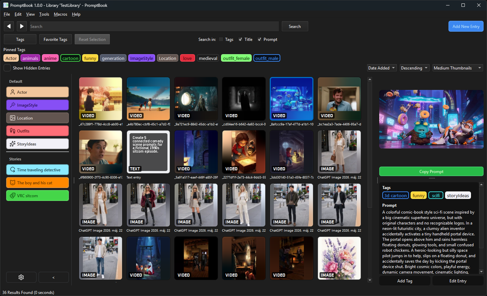

# PromptBook

## A Prompt-Focused Media Library for AI-Generated Content

{ width=80% }

PromptBook v1.0 running on macOS Sequoia.

PromptBook is a desktop application for organizing prompts, generated images, generated videos, reference files, and related creative assets in one searchable library.

It is built around a flexible tag-based system, custom metadata fields, and local library storage. PromptBook does not require proprietary project files, does not fill your folders with sidecar files, and does not force you to reorganize your existing file structure.

[:material-download: Download Latest Release](https://github.com/joolaszlo/PromptBook/releases){ .md-button .md-button--primary }

## :material-star: Core Features

- :material-file-multiple:{ .lg .middle } **[All Files](entries.md) Welcome**

***

PromptBook can be used with images, videos, prompt files, documents, and other related media. Common file types have built-in preview support.

[:material-arrow-right: See Full Preview Support](preview-support.md)

- :material-tag-text:{ .lg .middle } **Create [Tags](tags.md) Your Way**

***

- :material-format-font: No character restrictions
- :material-form-textbox: Add aliases and alternate names
- :material-palette: Customize colors and styles
- :material-tag-multiple: Tags can be tagged with other tags
- :material-star-four-points: Organize prompts, outputs, styles, models, characters, projects, and references

- :material-magnify:{ .lg .middle } **Powerful [Search](search.md)**

***

- Boolean operator support
- Filename, path, and extension search with [glob](https://en.wikipedia.org/wiki/Glob_(programming)) syntax
- General media types, such as image, video, audio, and document files
- Special searches, such as "Untagged"
- Smartcase case sensitivity

- :material-text-box:{ .lg .middle } **Text and Date [Fields](fields.md)**

***

Along with tags, you can add custom metadata fields such as titles, descriptions, source URLs, notes, prompt text, generation notes, and dates.

## :material-toolbox: Built Different

- :material-scale-balance:{ .lg .middle } **Open Source**

***

PromptBook is licensed under GPL-3.0-only. The source code and releases are available on GitHub.

[:material-arrow-right: View License](https://github.com/joolaszlo/PromptBook/blob/main/LICENSE)

- :material-database:{ .lg .middle } **Central Library Database**

***

Instead of writing sidecar files next to your media, PromptBook uses a [library](libraries.md) system that stores your tags and metadata inside a central database for each library.

[:material-arrow-right: Learn About Libraries](libraries.md)

---

## :material-layers-triple: Why PromptBook?

PromptBook is designed for workflows where prompts, generated outputs, reference images, videos, notes, and project files belong together.

It can be used to track what was generated, which prompt or idea it came from, how it should be categorized, and how related files connect to each other.

- :material-map-check:{ .lg .middle } See the [**Roadmap**](roadmap.md) for future features and updates